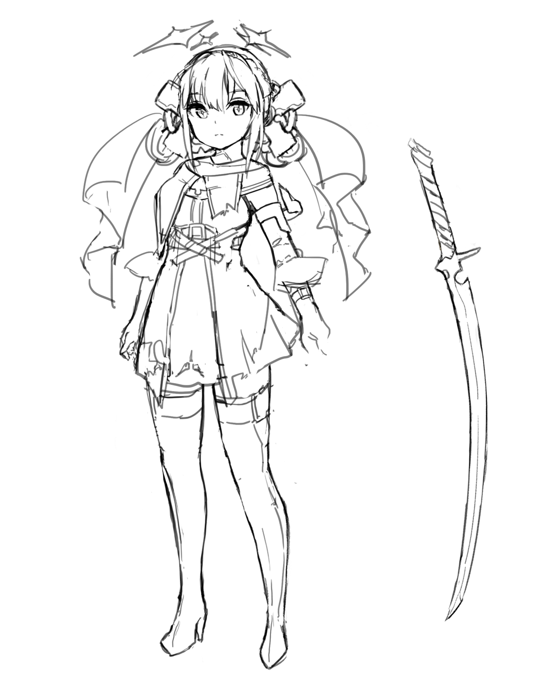
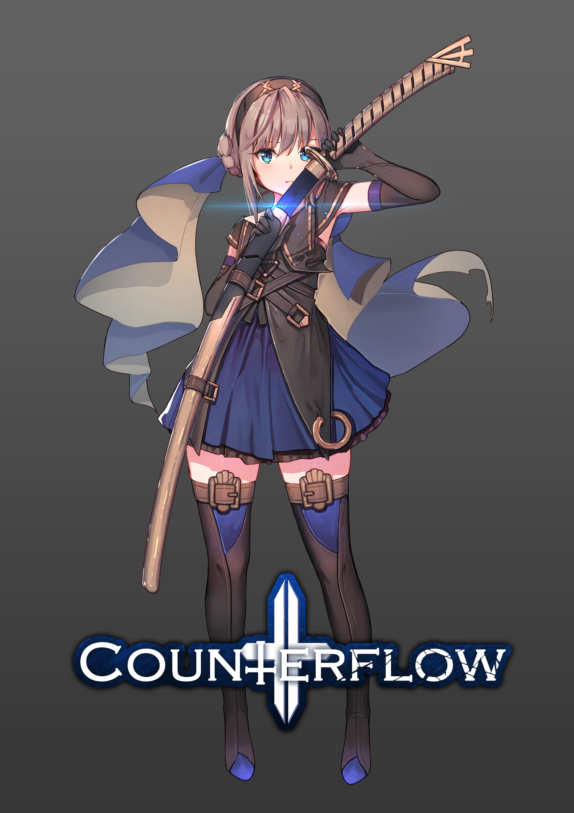

# Counterflow

## 개발인원
+ 윤정훈 2012181024 - 클라이언트
+ 이인호 2012181029 - 클라이언트
+ 이후림 2012181032 - 그래픽디자인
*****
## 게임소개
1. 이름 : Counterflow(카운터플로우)
2. 장르 : 액션 + 탐험
3. 플랫폼 : PC
4. 특징
    * 3D + 쿼터뷰시점
    * 로그라이크장르의 일부 요소를 가져와 짧지만 강렬한 게임플레이
    * 트위치 IRC서버와 연동하여 투표를 통해 시청자들이 게임에 개입하는 것이 가능
    * Live 2D를 활용한 몰입력있는 컷신연출
    * 다양한 아이템으로 자신만의 특별한 게임경험을 느낄 수 있다
*****
## 개발환경
* Unity3D (2017.3.0f3)
* Visual Studio 2017
* 3Ds Max
* Cubism 3.0
* Adobe Photoshop CS6
* Adobe AfterEffects
* GitHub
* Taiga Kanban
* Open Broadcast Software(for Twitch API test)
*****

